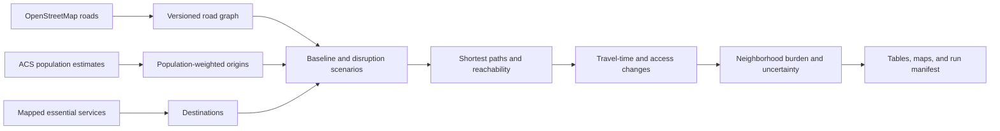

# System architecture

The pipeline freezes its road graph and input tables before comparing the
baseline with random and high-betweenness closures. Each scenario uses the same
origins and destinations, which keeps the comparison attributable to the road
changes rather than changing demand data.

The current travel times are network estimates, not observed traffic. A city
operations version would need probe-speed calibration, live closures, validated
facility status, and an operational update schedule.
